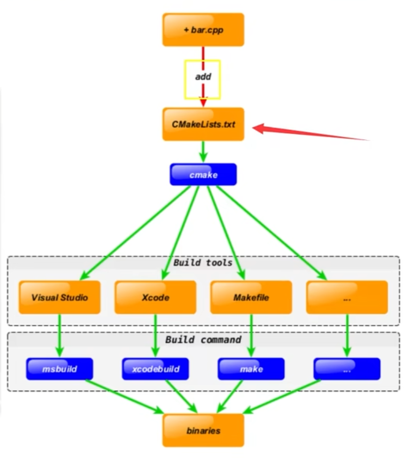

## 一、开发环境搭建
### 1. 编译器、调试器安装
    1) 安装gcc, gdb
        sudo apt update
        sudo apt install build-essential gdb
    2) 安装成功确认
        gcc --version
        g++ --version
        gdb --version

### 2. CMake安装
    sudo apt install cmake
    cmake --version

## 二、GCC编译器
### 1.编译过程
直接编译命令：g++ test.cpp -o test 
1. 预处理:
    g++ -E test.cpp -o test.i
2. 编译：
    g++ -S test.i -o test.s
3. 汇编
    g++ -c test.s -o test.o
4. 链接
    g++ test.o -o test

### 2. g++重要编译参数
    1) -g: 编译带调试信息的可执行文件
    2) -O[n]: 优化源代码
        一般选择-O2
      g++ -O2 test.cpp  
    3) -l 和 -L 指定库文件 | 指定库文件路径
    4）-std=c++11 设置编译标准
    5） -D 定义宏 

## 三、 CMake
### 1. CMake跨平台
 
### 2. 语法特性介绍
* 基本语法格式：指令（参数1 参数2...)
    * 参数使用括弧括起
    * 参数之间使用空格或分号分开
* 指令与大小写无关，参数和变量与大小写相关  
```c++
    set(HELLO hello.cpp)
    add_executable(hello main.cpp hello.cpp)
    ADD_EXECUTABLE(hello main.cpp ${HELLO}) 
```
* **变量使用${}方式取值，但是在IF控制语句中是直接使用变量名** 

### 3. 重要指令和CMake常用变量
* cmake_minimum_required-指定CMake的最小版本要求
* project-定义工程名称，并可指定工程支持的语言
* set-显示的定义变量
* include_directories-先工程添加多个特定的头文件搜索路径
* link_directories-向工程添加多个特定的库文件搜索路径

### 4. DEBUG
**主要修改program和preLaunchTask**
launch.json文件如下：
```JSON
{
    // Use IntelliSense to learn about possible attributes.
    // Hover to view descriptions of existing attributes.
    // For more information, visit: https://go.microsoft.com/fwlink/?linkid=830387
    "version": "0.2.0",
    "configurations": [ 

        {
            "name": "(gdb) Launch",
            "type": "cppdbg",
            "request": "launch",
            "program": "${workspaceFolder}/7.11/build/my_cmake_exe",
            "args": [],
            "stopAtEntry": false,
            "cwd": "${fileDirname}",
            "environment": [],
            "externalConsole": false,
            "MIMode": "gdb",
            "setupCommands": [
                {
                    "description": "Enable pretty-printing for gdb",
                    "text": "-enable-pretty-printing",
                    "ignoreFailures": true
                },
                {
                    "description": "Set Disassembly Flavor to Intel",
                    "text": "-gdb-set disassembly-flavor intel",
                    "ignoreFailures": true
                }
            ],
            "preLaunchTask": "Build"
        }  
    ]
}
```
**修改options的cwd，编译文件的路径**
tasks.json如下：
```json
{
    "version": "2.0.0",
    "options": {
        "cwd": "${workspaceFolder}/7.11/build"
    },
    "tasks": [
        {
            "type": "shell",
            "label": "cmake1",
            "command": "cmake",
            "args": [
                ".."
            ]
        },
        {
            "label": "make1",
            "group": {
                "kind": "build",
                "isDefault": true
            },
            "command": "make",
            "args": []
        },
        {
            "label": "Build",
            "dependsOrder": "sequence",
            "dependsOn": [
                "cmake1",
                "make1"
            ]
        }
    ],
}
```


### 标准的CMakeLists.txt格式
```python
# Copyright (c) Huawei Technologies Co., Ltd. 2019. All rights reserved.

# CMake lowest version requirement
cmake_minimum_required(VERSION 3.5.1)

# project information
project(sampleYOLOV7MultiInput)

# Compile options
add_compile_options(-std=c++11)

set(CMAKE_RUNTIME_OUTPUT_DIRECTORY  "../../../out")
set(CMAKE_CXX_FLAGS_DEBUG "-fPIC -O0 -g -Wall")
set(CMAKE_CXX_FLAGS_RELEASE "-fPIC -O2 -Wall")

set(INC_PATH $ENV{DDK_PATH})
if (NOT DEFINED ENV{DDK_PATH})
    set(INC_PATH "/usr/local/Ascend/ascend-toolkit/latest")
    message(STATUS "set default INC_PATH: ${INC_PATH}")
else()
    message(STATUS "set INC_PATH: ${INC_PATH}")
endif ()

set(LIB_PATH $ENV{NPU_HOST_LIB})
if (NOT DEFINED ENV{NPU_HOST_LIB})
    set(LIB_PATH "/usr/local/Ascend/ascend-toolkit/latest/runtime/lib64/stub")
    message(STATUS "set default LIB_PATH: ${LIB_PATH}")
else()
    message(STATUS "set LIB_PATH: ${LIB_PATH}")
endif ()


add_definitions(-DENABLE_DVPP_INTERFACE)
list(APPEND COMMON_DEPEND_LIB avcodec avformat avutil swresample swscale)
aux_source_directory(${PROJECT_SOURCE_DIR}/../common/src aclLite)
list(REMOVE_ITEM aclLite ${PROJECT_SOURCE_DIR}/../common/src/CameraCapture.cpp)

# Header path
include_directories(
        /usr/include/
        ${INC_PATH}/runtime/include/
        ../inc/
        ../common/include/
)

if(target STREQUAL "Simulator_Function")
    add_compile_options(-DFUNC_SIM)
endif()

# add host lib path
link_directories(
        ${INC_PATH}/runtime/lib64/stub
        ${INC_PATH}/thirdpart/lib
)

add_executable(main
        dataInput/dataInput.cpp
        detectPreprocess/detectPreprocess.cpp
        detectInference/detectInference.cpp
        detectPostprocess/detectPostprocess.cpp
        dataOutput/dataOutput.cpp
	    pushrtsp/pictortsp.cpp
        pushrtsp/pushrtspthread.cpp
        main.cpp)

target_sources(main 
    PUBLIC
        ${aclLite})

if(target STREQUAL "Simulator_Function")
    target_link_libraries(main funcsim)
else()
    target_link_libraries(main ascendcl acl_dvpp stdc++ pthread ${COMMON_DEPEND_LIB} jsoncpp opencv_highgui opencv_core opencv_imgproc opencv_imgcodecs opencv_calib3d opencv_features2d opencv_videoio dl rt X11)
endif()

install(TARGETS main DESTINATION ${CMAKE_RUNTIME_OUTPUT_DIRECTORY})

```