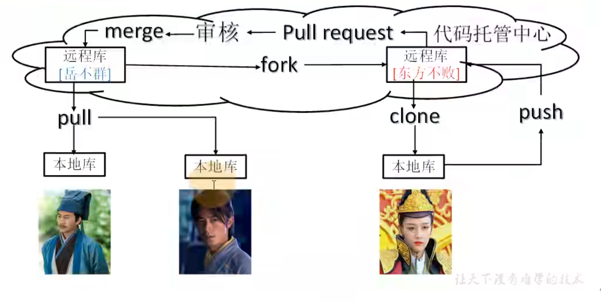

## 1. 删除github的repository
进入仓库，点击Settings，找到Danger Zone中的Delete this repository

## 2. Git常用命令   
    1. git init 初始化本地库  
    2. git status 查看本地库状态  
    3. git add hello.txt 将文件添加到暂存区  
    4. git commit -m "日志信息" 文件名： 将暂存区的文件提交到本地库
    5. git reflog :查看版本信息； git log: 查看详细版本信息
    6. 版本穿梭
       6.1 git reflog: 获取版本号
       6.2 git reset --hard 版本号 ：穿梭到对应的版本

## 3. Git分支操作
    1) 查看分支：git branch -v
    2) 创建分支：git banch 分支名
    3) 切换分支：git checkout hot-fix： 切换到hot-fix分支
    4) 合并分支：git merge 分支名： 把指定的分支合并到当前的分支上 

## 4. Git团队协作机制
### 4.1团队内协作

### 4.2团队外协作

## 5. Github操作
### 5.1 在Github上创建远程仓库
### 5.2 远程仓库操作  
    1）创建远程仓库别名
        git remote add git-demo https://github.com/Hruyi001/git-demo.git
    2） 查看远程仓库别名： git remote -v
    3) 推送本地分支到远程仓库： git push git-demo master,  git-demo代表git@github.com:Hruyi001/git-demo.git
    4) 拉取远程库到本地库：git pull git-demo master
    5) 克隆远程库到本地库：git clone https://github.com/Hruyi001/git-demo.git 
       5.1) 拉取代码
       5.2）初始化本地库
       5.3）创建别名，origin
### 5.3 团队间协作
fork 对方团队的项目，修改项目文件，通过Pull request向对方团队提交请求

### 5.4 ssh免密登录
    1) cd C:\Users\29173
    2) ssh-keygen -t rsa -C 2917398357@qq.com
    3) cd .ssh, 复制id_rsa.pub公钥到github上